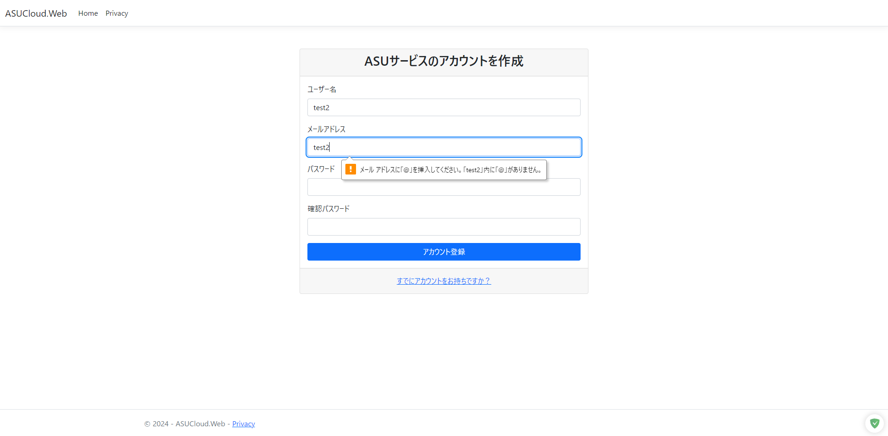
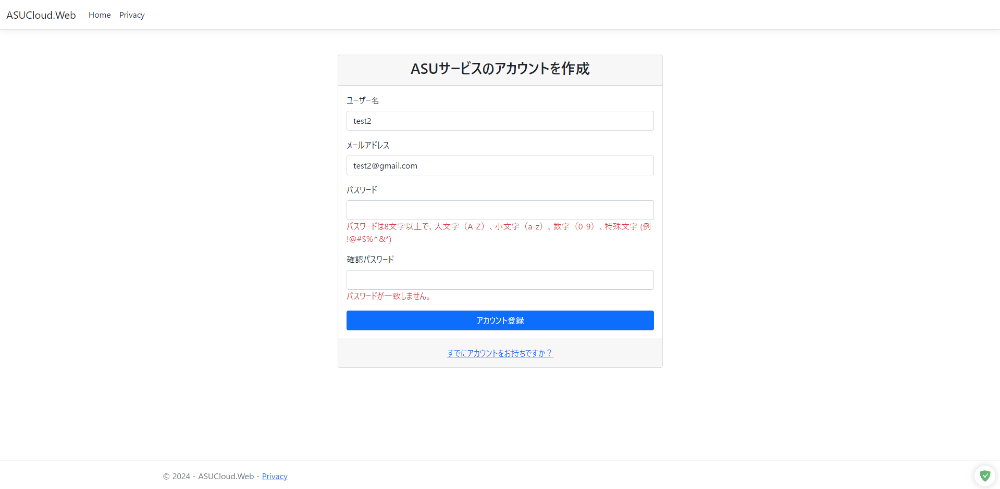

# ASUUserService
面接ためにプロジェクトを開発

# 目録
* [結果](#結果のスクリーンショット)
* [実装のアイデア](#設計書)
* [データベースのテーブル構造などの基本情報](#設計書##ER図)
* [動作方法](#動作方法)
* [ガイドライン](#ガイドライン)

# 動作方法
 ASUCloud.Webディレクトリで `dotnet run` コマンドを実行します。

# 結果のスクリーンショット
* ログイン画面

* 登録画面

* クライアントのフィールド検証

* サーバー側のフィールド検証

* JWT関すること

# ガイドライン
* [一般的な C# のコード規則](https://learn.microsoft.com/ja-jp/dotnet/csharp/fundamentals/coding-style/coding-conventions)
* [DDDとClean Architecture](https://knowledge.sakura.ad.jp/36776/)
* [イベント駆動](https://ja.wikipedia.org/wiki/%E3%82%A4%E3%83%99%E3%83%B3%E3%83%88%E9%A7%86%E5%8B%95%E5%9E%8B%E3%83%97%E3%83%AD%E3%82%B0%E3%83%A9%E3%83%9F%E3%83%B3%E3%82%B0)

# 設計書

## ユースケース

## アーキテクチャ
このアーキテクチャ図は、あくまでも理想的な設計図であり、実際の実装は、より実装しやすい方法で部分的に行われる。

## 画面設計
以下のデザインは、ページ要素の単なるリストであり、具体的なスタイルはブートストラップで美化されます。

## ER図

## シーケンス設計
このシーケンス図は、ログインと登録のプロセスを明確にするためのものであり、具体的なクラス名や実装は若干異なる場合があります。

# ハイライト
